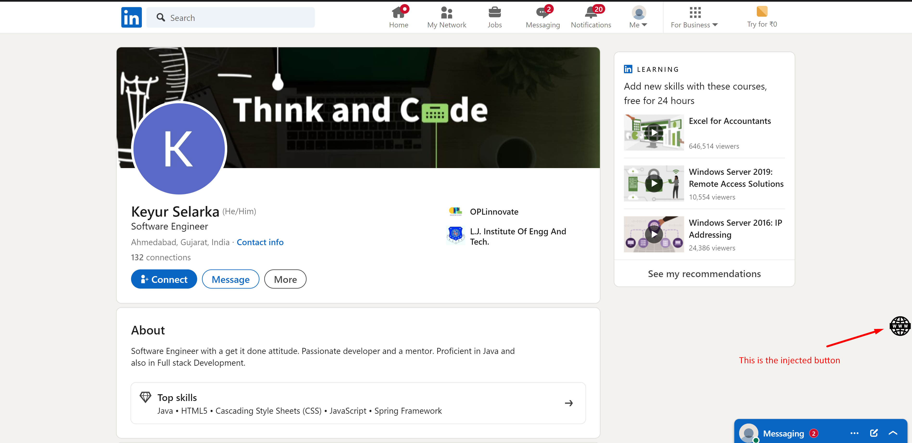
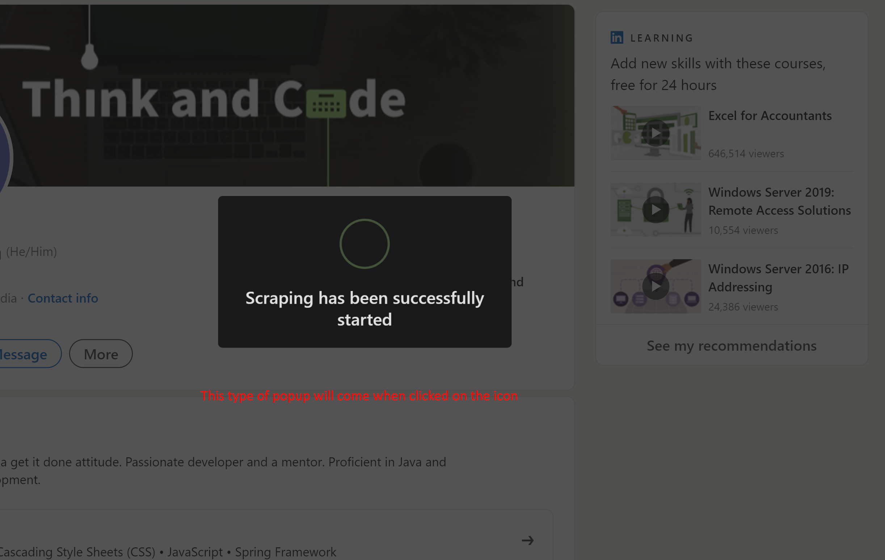
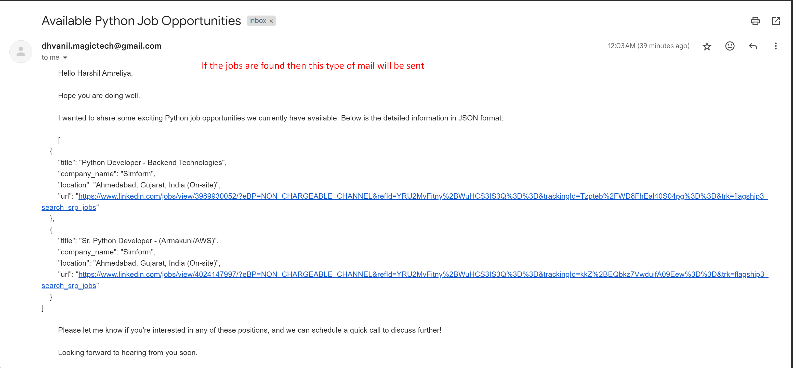

# Job Tracker

## Overview

Job Tracker is a Chrome extension that allows users to scrape LinkedIn profiles for job opportunities and receive them via email. The extension works seamlessly with a Flask API to handle the scraping and notifications.

## Features

- **Profile Scraping**: Easily scrape LinkedIn profile information and cookies.
- **Job Opportunities**: Automatically gather job listings relevant to the scraped profile.
- **Email Notifications**: Get job opportunities sent directly to your email.

## Installation

### Chrome Extension

1. **Clone the Repository**:
   ```bash
   git clone <repository-url>
   cd job-tracker
   ```

2. **Install Dependencies**:
   Run the following command to install the required packages:
   ```bash
   npm install --force
   ```

3. **Build the Extension**:
   Generate the build for the Chrome extension:
   ```bash
   ng build
   ```
   or
   ```bash
   npm run build
   ```

4. **Load the Extension into Chrome**:
   - Open Chrome and navigate to `chrome://extensions/`.
   - Enable "Developer mode".
   - Click on "Load unpacked" and select the `dist` folder created during the build process.

### Usage

- The extension will only be visible on LinkedIn profile pages. Ensure the URL contains `https://www.linkedin.com/in/`.
- Once on a profile page, click the extension icon located on the right-hand side.
- The extension will scrape the profile's name and required cookies and send them to the API for job scraping.

## Flask API

The Flask API handles the job scraping process:

1. It receives the required cookies via a JSON request.
2. Sets up a Selenium Chrome browser instance with the received cookies.
3. Scrapes job opportunities based on the LinkedIn profile information.
4. Sends any available job listings to the user's email.

## Requirements

- **Node.js**: Ensure you have Node.js installed for the Angular app.
- **Flask**: Python Flask for the backend API.
- **Selenium**: To automate web scraping.

## Screenshots






## Video Tutorial

[![Watch the video]](https://drive.google.com/file/d/1Tl3Hvm3y-Ri0t4elydyJnJGoOlzkF9uL/view?usp=sharing)
